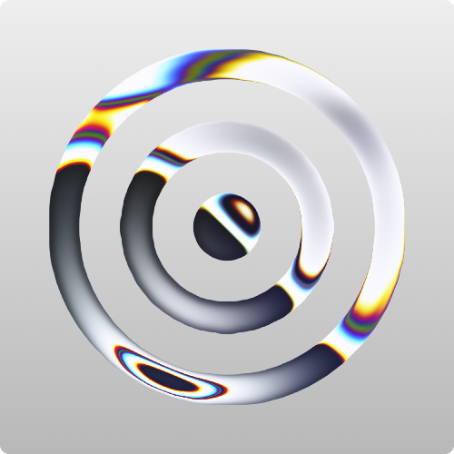

<!-- Read Me of NeKernel -->

<div align="center">
  
  <h1>NeKernel</h1>
  <p>
    <b>Modern, Modular, and Secure Microkernel for Next-Generation Systems</b>
  </p>
  <p>
    <a href="https://github.com/nekernel-org/nekernel/actions/workflows/boot-pio.yml"></a>
    <a href="https://github.com/nekernel-org/nekernel/actions/workflows/kernel-ahci.yml"></a>
    <a href="LICENSE"></a>
    
  </p>
</div>

---

## Overview

**NeKernel** is a modern, multi-platform microkernel designed for security, modularity, and performance. It features a custom VFS, advanced memory management, a flexible DDK (Driver Development Kit), and robust userland tools. NeKernel is built for research, education, and next-generation OS development.

---

## Features

- **Modular Microkernel Architecture**: Clean separation of kernel, drivers, userland, and frameworks. 

- **Custom Filesystems**: (HeFS), catalog/fork model (NeFS), and metadata handling.

- **Memory Management**: Custom heap manager, page manager, and safe memory utilities. Kernel heap allocations are protected with metadata and CRCs. Userland and kernel memory separation.

- **Device and Driver Model**: Abstracted device interfaces for storage, network, and more. DDK (Device Driver Kit) for writing drivers in C/C++ with kernel RPC and memory-safe APIs.

- **Userland Tooling**: CLI tools for formatting, checking, and managing filesystems, disk image utilities, and system utilities. All tools interact with kernel or disk images using well-defined APIs.

- **System Call Interface**: low-level syscall ABI, with a stable high-level SDK for user applications. System calls are routed through a syscall manager and abstracted by `libSystem`.

- **Security and Robustness**: kernel and tools (bounds checks, safe memory copy/set, error codes). Kernel panics and error reporting for critical failures. No dynamic code loading in kernel space.

- **Documentation and Specs**: Full LaTeX specifications for HeFS and NeFS, with on-disk structure diagrams and API documentation. Markdown docs for tools and usage.

- **Cross-Platform Boot Support**: Bootloader and platform code for AMD64 and ARM64, with handover and hardware abstraction layers.

- **Testing and Debugging**: Logging, debug output, and kernel test framework headers. (Note: Fuzzing/sanitizer support is planned but not fully implemented.)

---

## Getting Started

### **Requirements**
- [MinGW](https://www.mingw-w64.org/) (cross-compiling)
- [Clang](https://clang.llvm.org/)
- [NASM](https://nasm.us/)
- [NeBuild](https://github.com/nekernel-org/nebuild) (build system)

### **Build & Run**

```sh
git clone https://github.com/nekernel-org/nekernel.git
cd nekernel
./setup_x64.sh
./debug_ata_x64.sh   # For generic ATA PIO target (QEMU)
```

- For ARM64 or other targets, see the scripts in `dev/boot/`.

---

## Structure

- `dev/kernel/` — Core kernel source (scheduling, memory, VFS, drivers)
- `dev/boot/` — Bootloader, platform bring-up, and early system code
- `dev/ddk/` — Driver Development Kit (DDK) and sample drivers
- `dev/libSystem/` — Userland system call interface and runtime
- `public/tools/` — CLI tools (mkfs, fsck, open, manual, etc.)
- `public/frameworks/` — Userland frameworks (CoreFoundation, DiskImage, etc.)
- `docs/` — Specifications, design docs, and diagrams

---

## Security

- **Vulnerability Disclosure:**  
  Please report security issues privately via email or GitHub Security Advisories.

---

## Documentation

- [API Reference (Doxygen)](https://nekernel-org.github.io/doc/)
- [Filesystem Specifications](docs/tex/)

---

## Contributing

- Please run `format.sh` before committing (uses `.clang-format`).
- All contributions (code, docs, fuzzing, security) are welcome!

---

## Authors & Credits

- **Amlal El Mahrouss** — Lead developer, kernel architect
- [Full contributor list](https://github.com/nekernel-org/nekernel/graphs/contributors)

---

## License

This project is licensed under the [GPL-3.0 License](LICENSE).

---

<div align="center">
  <sub>
    &copy; 2024-2025 Amlal El Mahrouss & NeKernel contributors. All rights reserved.
  </sub>
</div>
