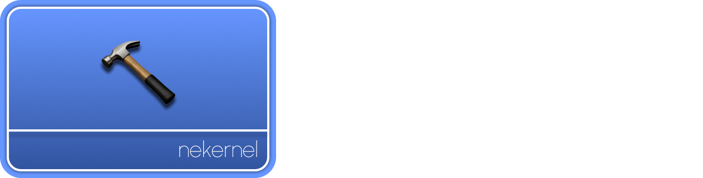

<!-- Read Me of NeKernel -->

<div align="center">
  
  <h1>NeKernel</h1>
</div>


[](LICENSE)
[](#)

## Brief:

A kernel for engineers who want a custom solution for their stack, written mostly in C++ it aims to provide a base for other projects/products.

## User Friendly Diagram:

<div align="center">
  
</div>

## Notice for Doxygen:

Use the doxygen command to build documentation.
<br/>
A documentation regarding building, and developing for NeKernel is available here: https://amlel-el-mahrouss.github.io/nekernel-docs/

## Requirements:

- [MINGW-W64](https://www.mingw-w64.org/)
- [CLANG](https://clang.llvm.org/)
- [NASM](https://nasm.us/)
- [GIT](https://git-scm.com/)
- [BTB](https://github.com/amlel-el-mahrouss/btb)

## Notice for Contributors:

- You must mount the contents to the nekernel-esp.img prior running!
    - It depends mostly on how your platform manages them, so have a look at it.

- Run `format.sh` before commiting, it formats the code according to the .clang-format.

## Getting Started:

```sh
git clone git@github.com:amlel-el-mahrouss/nekernel.git
cd nekernel
./setup_amd64.sh
./debug_ata_x64.sh # Generic ATA PIO target
```

###### Copyright (C) 2024-2025 Amlal El Mahrouss, All rights reserved.
